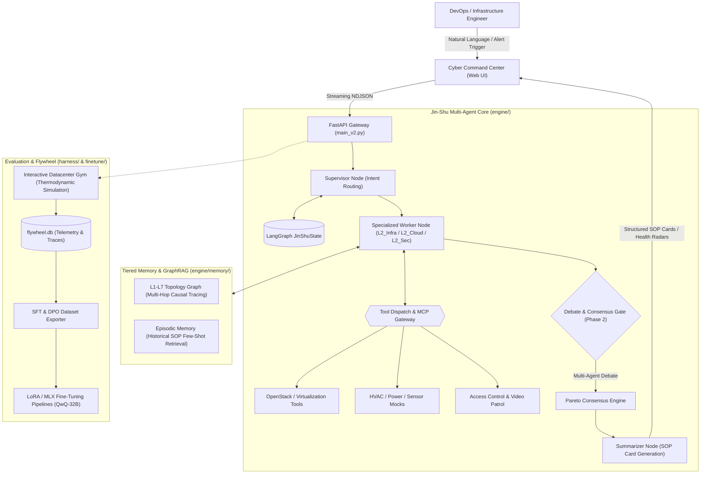

# Jin-Shu OS 2.0 (金枢)
### Enterprise Full-Stack Datacenter Multi-Agent Intelligent Advisory Platform

[](https://www.python.org/)
[](https://fastapi.tiangolo.com)
[](https://github.com/hanfield/Jinjing_Agent/actions/workflows/ci.yml)
[](#architecture)
[](#enterprise-evaluation-harness)
[](#data-flywheel--continuous-learning)
[](#license)

---

## 📖 Overview

**Jin-Shu OS 2.0 (金枢)** is an industrial-grade, LLM-powered Multi-Agent decision-support platform tailored for mission-critical financial data centers. Named after the pivotal celestial hub (*Jin-Shu*), the platform bridges long-standing silos between physical infrastructure (L1: Power, HVAC, Physical Security, UPS) and logical IT workloads (L3–L7: Cloud Compute, Networks, Middleware, Applications).

Operating strictly in an **advisory and consultative role (Human-in-the-Loop)**, Jin-Shu autonomously synthesizes multi-tier telemetry, conducts chain-of-thought root-cause diagnoses, generates step-by-step Emergency SOPs (Standard Operating Procedures), and optimizes thermal dissipation before thermal runaway or SLA degradation occurs.

---

## 🌟 Key Highlights

- **Star-Topology Multi-Agent Engine**: Orchestrates specialized agents (Supervisor, Worker, Guardrail, Summarizer) communicating through a shared **Global Blackboard** and an asynchronous Event Bus.
- **L1–L7 Cross-Domain Telemetry Fusion**: Correlates chiller airflow and UPS redundancy metrics with hypervisor CPU loads and database connection pool bottlenecks.
- **Predictive Precision Cooling**: Proactively forecasts hotspot progression based on IT traffic surge predictions, recommending HVAC frequency adjustments before PDU limits trip.
- **Multi-Agent Debate & Consensus (Phase 2)**: Resolves multi-objective conflicts between physical cooling (PUE optimization) and cloud workloads (SLA protection) via Pareto-optimal arbitration.
- **Tiered Memory & Topology GraphRAG (Phase 2)**: Couples L1-L7 physical/logical infrastructure graph relations with episodic memory retrieval for historical incident few-shot injection.
- **Stateful Datacenter Gym & Harness (Phase 2)**: Features an interactive thermodynamic state machine sandbox with chaos injection, moving beyond static mocks.
- **GRPO Verifiable Reinforcement Learning (Phase 3)**: Aligns reasoning policies via Group Relative Policy Optimization with mathematical rule-based verifiable rewards (RLVR) without neural critics.
- **Multimodal Infrared Thermal Vision (Phase 3)**: Ingests 2D thermal camera matrices to diagnose vertical thermal stratification (ASHRAE standards) and robotic visual patrol frames.
- **Self-Evolving Data Flywheel**: Logs production runs, TTFT, and span traces into SQLite (`flywheel.db`), compiling high-signal datasets for SFT, DPO, and GRPO alignment.

---

## 🏗️ Architecture



---

## 📂 Project Structure

```text
Jinjing_Agent/
├── engine/                       # Core Multi-Agent Orchestrator
│   ├── agents/                   # Agent base classes & event bus
│   ├── core/                     # Graph workflow, state, streaming engine
│   ├── nodes/                    # Supervisor, Worker, Guardrail, Summarizer
│   ├── protocols/                # Client definitions & message schemas
│   ├── services/                 # Monitoring ingestion & alert synthesis
│   └── tools/                    # Infrastructure, Cloud, Security & MCP tools
├── harness/                      # Enterprise Evaluation Framework
│   ├── adapters/                 # Base and Jin-Shu specific agent adapters
│   ├── configs/                  # Benchmark & evaluation profiles (JSON)
│   ├── environments/             # Transparent sandbox proxy & chaos injector
│   ├── evaluators/               # Metrics engine (Dual-core: TTFT + LLM Judge)
│   └── tasks/                    # Task suite registry with snapshot hydration
├── finetune/                     # Continuous Learning & Alignment
│   ├── prepare_data.py           # SFT dataset generator from flywheel records
│   ├── prepare_qwen_data.py      # Qwen-specific conversational alignment
│   ├── train_lora.py             # PyTorch LoRA fine-tuning script
│   └── train_mlx_lora.py         # Apple Silicon MLX LoRA training script
├── data/                         # Datacenter fixtures, knowledge bases, snapshots
│   ├── datacenter_mock.json      # Simulated L1-L7 live metrics
│   ├── fault_fingerprint_library # Empirical root-cause signature repository
│   └── expert_knowledge.md       # RAG knowledge base for datacenter SOPs
├── docs/                         # Architecture diagrams, whitepapers, proposals
├── scripts/                      # Testing, flowchart visualizer & report scripts
├── static/                       # Cyberpunk-style operational dashboard frontend
├── main_v2.py                    # Production FastAPI entry point (JWT Auth + SSE)
├── pyproject.toml                # Project metadata & build dependencies
└── requirements.txt              # Production dependency specifications
```

---

## 🚀 Quickstart

### 1. Prerequisites

- Python `>= 3.10`
- Optional: Virtual environment manager (`venv`, `conda`)
- LLM API Endpoint (OpenAI-compatible: GPT-4, Qwen, DeepSeek, vLLM, etc.)

### 2. Installation

Clone the repository and set up a virtual environment:

```bash
git clone https://github.com/hanfield/Jinjing_Agent.git
cd Jinjing_Agent

python3 -m venv venv
source venv/bin/activate
pip install -r requirements.txt
pip install -e ".[dev]"
```

### 3. Environment Configuration

Create a `.env` file in the project root:

```bash
# LLM Endpoint Configuration (Phase 1 Native Reasoning Edition)
OPENAI_API_KEY="your-api-key-here"             # Or "none" for local vLLM
OPENAI_BASE_URL="http://localhost:8000/v1"     # vLLM on 2x H100 or OpenAI/DeepSeek endpoint
LLM_MODEL="Qwen/QwQ-32B"                       # Reasoning models: Qwen/QwQ-32B, deepseek-reasoner


# Server Port
PORT=8000

# Monitoring Mode: MOCK or EXTERNAL_API
MONITOR_MODE="MOCK"

# (Optional) OpenStack Integration
OPENSTACK_AUTH_URL="http://controller:5000/v3"
OPENSTACK_USERNAME="admin"
OPENSTACK_PASSWORD="password"
OPENSTACK_PROJECT_NAME="admin"
OPENSTACK_USER_DOMAIN_NAME="Default"
OPENSTACK_PROJECT_DOMAIN_NAME="Default"
OPENSTACK_REGION_NAME="RegionOne"
```

### 4. Running the Platform

Launch the FastAPI consultative server with the cybernetic UI:

```bash
python main_v2.py
```

- **Web Dashboard**: Access the interactive operations console at `http://localhost:8000/`
- **Interactive API Docs**: View Swagger docs at `http://localhost:8000/docs`

---

## 🧪 Enterprise Evaluation Harness

Jin-Shu includes an automated evaluation harness designed to benchmark agent performance under chaotic and realistic data center conditions.

### Run Standard Evaluation:

```bash
make eval
# Equivalent to:
python -m harness.cli --config harness/configs/default_eval.json
```

### Run Enterprise Rigorous Benchmark:

```bash
python -m harness.cli --config harness/configs/enterprise_eval.json
```

**Key Evaluation Pillars:**
- **Data Hydration**: Hydrates real point-in-time snapshots (`snapshot_uri`) rather than static mock states.
- **Chaos Injection**: Simulates transient network delays and tool execution failures (`failure_rate`) to validate self-healing logic.
- **Dual-Core Scoring**: Evaluates structural engineering metrics (TTFT, token budget, tool call validity) alongside LLM rubric evaluation.

---

## 🔄 Data Flywheel & Fine-Tuning

The platform continuously improves through its embedded SQLite execution traces:

```bash
# 1. Export high-scoring successful traces into training data
python finetune/prepare_data.py

# 2. Convert to Qwen-formatted chat templates
python finetune/prepare_qwen_data.py

# 3. Trigger LoRA fine-tuning (PyTorch / MLX)
python finetune/train_lora.py
# Or on Apple Silicon:
python finetune/train_mlx_lora.py

# 4. Trigger GRPO Rule-Based Verifiable Reinforcement Learning (Phase 3)
python -m finetune.train_grpo --eval_only
```

---

## 🔄 CI/CD & Automated Evaluation Pipeline

Jin-Shu OS includes an enterprise-grade automated CI/CD pipeline running on GitHub Actions (`.github/workflows/ci.yml`):

1. **Code Quality & Linting (`lint`)**:
   - Enforces Python 3.10+ modern standards with `ruff`.
   - Validates syntax tree compilation across `engine/`, `harness/`, and `finetune/`.
2. **Matrix Regression Suite (`unit-tests`)**:
   - Runs `pytest` with `pytest-asyncio` on Python `3.10`, `3.11`, and `3.12`.
   - Exercises 17 automated test cases: L1-L7 Topology Graph causal tracing, Episodic Memory few-shot recall, Multi-Agent Debate arbitration, Stateful Datacenter Gym thermodynamics, GRPO RLVR mathematical reward functions, and Multimodal Infrared Thermal Vision diagnostics.
   - Archives JUnit test reports as workflow artifacts.
3. **Agent Evaluation Harness (`eval-harness`)**:
   - Executes standard test suites (`harness/configs/default_eval.json`) in headless CI mode.
   - Computes dual-core engineering metrics and LLM judge scoring.
   - Automatically exports and persists `finetune/flywheel.db` and execution traces as build artifacts.
4. **Production Docker Build Verification (`docker-build`)**:
   - Compiles and validates the container image against `Dockerfile` with layer caching.

---

## 🛠️ Development & Testing

```bash
# Run unit and integration tests
make test

# Code formatting & linting
make format
make lint

# Clean temporary build and cache artifacts
make clean
```

---

## 📜 Development Standards & Rules

- **Advisory Only**: Jin-Shu never executes destructive infrastructure operations autonomously. All high-risk proposals output human-approvable SOP cards.
- **Strict Async First**: All I/O, tool executions, and external communications use Python's asynchronous `asyncio` primitives.
- **LLM Independence**: Model definitions and endpoints are fully parameterized via `.env`.
- **Telemetry Granularity**: Multi-agent handoffs capture `span_traces` detailing latency, token distribution, and intermediate reasoning chains.

For deeper agent developer specifications, consult [`AGENTS.md`](./AGENTS.md).

---

## 📄 License

This project is licensed under the [MIT License](LICENSE).
