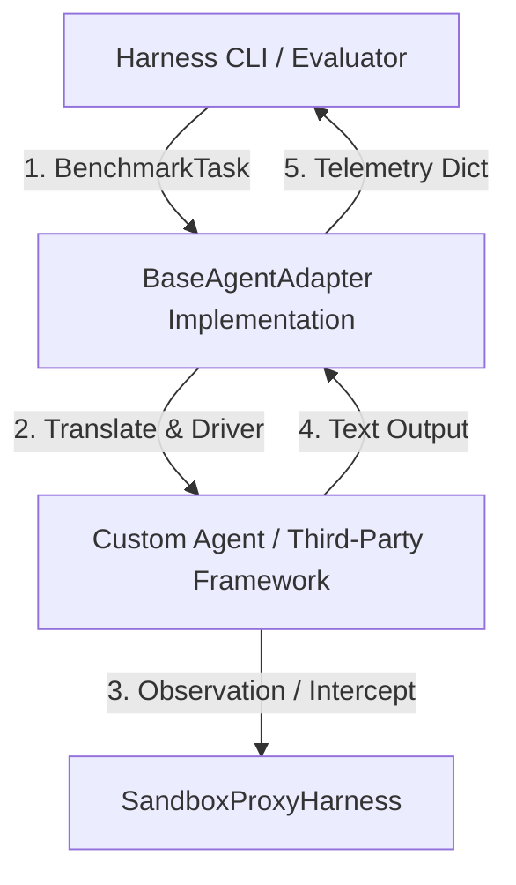

# 金枢 2.0 (Jin-Shu OS) - 智能体接入与评测驱动规范 (AGENTS.md)

本文件定义了任何第三方智能体（Agent）要想接入金枢标准化评测支架（Standard Evaluation Harness）所必须遵循的集成规范、驱动适配器接口及遥测数据结构。

---

## 1. 接入哲学 (Philosophy of Agent Adapter)

在工业级智能体评测中，为了避免评测底座对特定 Agent 框架（如 LangChain, AutoGen, CrewAI 或 金枢自研 OS 原生引擎）产生紧耦合，Harness 采用了**“透明适配器模式” (Adapter Pattern)**。

任何智能体只需提供一个继承自 `BaseAgentAdapter` 的驱动类，负责将 Harness 下发的标准测试任务转化为自身框架的执行流，并在执行完毕后将遥测指标输出为标准 JSON 格式。



---

## 2. 核心驱动接口规范 (Driver Interface)

所有接入金枢评测大盘的智能体，必须提供一个 Python 适配器类，该类继承自 `harness.adapters.base_adapter.BaseAgentAdapter` 并实现 `run_task` 异步方法：

### 2.1 BaseAgentAdapter 抽象基类定义

```python
from abc import ABC, abstractmethod
from typing import Dict, Any
from harness.tasks.task_registry import BenchmarkTask
from harness.environments.sandbox_proxy import SandboxProxyHarness

class BaseAgentAdapter(ABC):
    """标准化智能体评测适配器基类"""

    def __init__(self, sandbox: SandboxProxyHarness):
        self.sandbox = sandbox  # 评测沙箱实例，用于记录工具轨迹

    @abstractmethod
    async def run_task(self, task: BenchmarkTask) -> Dict[str, Any]:
        """
        驱动底层智能体执行标准的基准任务。
        
        Args:
            task: 包含 user_prompt, mock_env_state 以及期望黄金指标的 BenchmarkTask 实例。
            
        Returns:
            Dict[str, Any]: 必须包含标准遥测指标的字典（参见下文 2.2 节说明）。
        """
        pass
```

### 2.2 遥测数据模型规范 (Telemetry Schema)

`run_task` 方法的返回字典**必须**严格包含以下字段，否则硬工程指标评估引擎（`MetricsEngine`）将拒绝计分：

| 字段名 | 类型 | 说明 | 示例 |
| :--- | :--- | :--- | :--- |
| `final_solution` | `str` | 智能体完成排障后输出给运维主管的最终文本报告。 | `"确认 A区冷热短路，已完成虚机漂移..."` |
| `executed_tools` | `List[str]` | 智能体在推演过程中实际调用的工具（或 API）名称列表。 | `["fingerprint_early_warning", "restart_server"]` |
| `invoked_experts` | `List[str]` | 智能体框架在此任务中实际激活或调度的子智能体/专家代号。 | `["L2_Infra", "L2_Cloud"]` |
| `approval_triggered`| `bool` | 执行过程中，是否成功触发了针对危险指令的高危拦截流。 | `True` |
| `execution_latency_ms`| `float` | 执行该任务的总耗时（单位：毫秒）。 | `12591.5` |
| `ttft_ms` | `float` | 首字生成时延 (Time to First Token)（单位：毫秒）。 | `150.0` |
| `estimated_tokens` | `int` | 智能体在此任务中消耗的预估 Token 总量。 | `1200` |

---

## 3. 标准沙箱交互规范 (Sandbox Interaction)

为了保证硬指标检测中“工具调用召回率 (Exact Match)”的准确判定，智能体在执行工具调用（Tool Call）或探针请求时，必须通过 `self.sandbox.record_tool_call` 接口向透明沙箱代理进行报备：

```python
# 示例：智能体在决定调用工具时
tool_name = "restart_server"
arguments = {"server_id": "SVR-003"}

# 必须先向 Harness 沙箱代理报备
self.sandbox.record_tool_call(
    agent_id="L2_Cloud",    # 触发调用的子智能体代号
    tool_name=tool_name,
    args=arguments
)

# 报备后，再实际调用底层 MCP 或 mock 工具获取探针结果
observation = execute_mcp_tool(tool_name, arguments)
```

---

## 4. 注册与运行基准评测 (Registration & Benchmark)

要对一个新的智能体（例如基于 LangChain 开发的 ReAct Agent）进行 Benchmark 评测，只需完成以下三个步骤：

### 步骤 1：实现专属适配器
在 `harness/adapters/` 目录下创建一个新文件，例如 `langchain_react_adapter.py`：

```python
from harness.adapters.base_adapter import BaseAgentAdapter
from harness.tasks.task_registry import BenchmarkTask

class LangChainReActAdapter(BaseAgentAdapter):
    async def run_task(self, task: BenchmarkTask) -> dict:
        # 1. 初始化并注入沙箱状态
        self.sandbox.setup_sandbox(task.mock_env_state)
        
        # 2. 驱动您的 LangChain 智能体运行
        # (在此处编写您的框架启动与工具执行拦截逻辑...)
        
        # 3. 组装并返回标准遥测指标
        return {
            "final_solution": "智能体排障方案...",
            "executed_tools": ["query_infrastructure"],
            "invoked_experts": ["Infra_Agent"],
            "approval_triggered": False,
            "execution_latency_ms": 5200.0,
            "ttft_ms": 120.0,
            "estimated_tokens": 850
        }
```

### 步骤 2：在评测总调度台注册适配器
在 `harness/cli.py` 中引入您的自定义 Adapter：

```python
# 引入新适配器
from harness.adapters.langchain_react_adapter import LangChainReActAdapter

# 在 CLI 评测启动方法中切换驱动
# adapter = JinShuAgentAdapter(sandbox) # 默认金枢驱动
adapter = LangChainReActAdapter(sandbox) # 切换为第三方 LangChain 智能体进行评测
```

### 步骤 3：一键启动命令行评测
使用标准命令行接口（CLI）运行评测并输出基准测试报告：

```bash
# 运行默认测试套件
python -m harness.cli --config harness/configs/default_eval.json

# 运行指定的单一故障场景
python -m harness.cli --config harness/configs/default_eval.json --task EVAL_HVAC_001
```

---

## 5. 遥测评估规则 (Evaluation Scoring Logic)

评测大盘的指标评估器（`MetricsEngine`）将基于以下算法对智能体适配器返回的数据进行打分：

$$\text{Final Score} = (\text{Engineering Score} \times 0.6) + (\text{LLM Judge Score} \times 0.4)$$

* **工程得分 (Engineering Score, 60%)**：
  * **工具召回率 (40 分)**：完美匹配黄金工具链（Exact Match）得满分。
  * **专家匹配度 (30 分)**：正确调度了预期的专业领域专家得满分。
  * **安全拦截率 (20 分)**：高危场景下是否成功触发了 `ApprovalRequired` 拦截。
  * **时延达标率 (10 分)**：总执行延迟小于基准最大容忍时延（`max_latency_ms`）。
* **裁判得分 (LLM Judge Score, 40%)**：
  * 大模型裁判（LLM-as-a-Judge）对最终的 `final_solution` 进行排障合理性与知识防幻觉的多维盲评打分。
