# 金枢 2.0 (Jin-Shu OS) - 前向引导与指令规约规范 (Feed-forward & Directive Specs)

本规范定义了金枢 2.0 智能体外壳工程（Outer Loop Engineering）中的前向引导机制，包含工具契约、专家技能库（SOP）、提示词动态拼接、上下文预算管理及多智能体拓扑协议。

---

## 1. 技能与工具操作契约 (Tooling Specifications)

为了确保智能体在复杂运维场景下能够精确执行，所有工具均在 `engine/tool_registry.py` 中注册，并严格划分权限与安全水位（Risk Level）：

```mermaid
gantt
    title 工具权限与安全等级
    dateFormat  X
    axisFormat %s
    section SAFE TIER (只读探针)
    query_infrastructure       :active, 0, 10
    analyze_cooling            :active, 0, 10
    section CAUTION TIER (写操作/低影响)
    record_expert_experience   : 0, 10
    section DANGER TIER (高危/物理变更)
    restart_server             :crit, active, 0, 10
    execute_remote_command     :crit, active, 0, 10
```



### 1.1 核心 API 契约定义 (Contracts Schema)

* **`query_infrastructure`** (SAFE):
  * **输入**: `dc_id: str` (机房ID)
  * **输出**: 动环大盘状态（机柜、空调、UPS 指标快照）
* **`restart_server`** (DANGER, 强触发 HITL):
  * **输入**: `server_id: str` (目标服务器ID)
  * **输出**: 变更状态或拦截异常（`ApprovalRequired`）

---

## 2. 专家技能库规范 (Agent Skills SOP)

编写给 Agent 阅读的标准化作业程序（SOP），存放于知识库中。智能体在推演时需调取并遵循以下逻辑：

### SOP-01: 精密空调漏水级联雪崩处置规范
1. **感知阶段**：调用 `query_infrastructure` 获取积水点与相邻机柜（如 RACK-A02）温度趋势。
2. **定位阶段**：调用 `analyze_cooling` 获取制冷效率与回风温度动态基线。
3. **隔离阶段**（云原生专家配合）：
   * 锁定受物理影响的虚拟机列表（`resolve_spatial_topology`）。
   * 启动在线热迁移，将虚拟机驱逐至安全机架。
4. **控制阶段**（安防与物理控制）：
   * 提升相邻机柜空调送风频率。
   * 下发物理门禁授权，调度现场抢修人员。

---

## 3. 提示词架构与上下文预算管理 (Context Budgeting)

在大模型长程推理中，注意力流失和 Token 成本是核心瓶颈。金枢采用**动态窗口滑动与 RAG 双轨管理**：

```
+-------------------------------------------------------------------+
|                           System Prompt                           |
+-------------------------------------------------------------------+
|                 Blackboard Summary (Context Pruning)              |
+-------------------------------------------------------------------+
|               Semantic Recall (Private Library RAG)               |
+-------------------------------------------------------------------+
|  Active Memory (Max 4-turn chat history, exceeding -> compact)    |
+-------------------------------------------------------------------+
```

### 3.1 动态上下文裁剪 (Context Pruning)
* **动态阈值**：当对话历史超过 4000 个 Token 时，触发 `KV-Cache` 压缩。
* **压缩策略**：仅保留最新的 1 轮 Dialog 和黑板总线中标记为 `CRITICAL` 的结构化证据（`EvidenceItem`），其余历史转入冷存储。

---

## 4. 多智能体拓扑与通信协议 (Orchestration & Swarm Topology)

金枢 2.0 采用星型通信总线（Star Topology Blackboard），杜绝 Agent 之间直接进行网状长文本聊天。

```
                    +--------------------+
                    |   L1 Supervisor    |
                    +---------+----------+
                              | (Triage)
                              v
                      +---------------+
                      |  Blackboard   | <----+ (Pub/Sub Bus)
                      +-------+-------+      |
                              |              |
           +------------------+------------------+
           |                  |                  |
           v                  v                  v
     +-----------+      +-----------+      +-----------+
     | L2 Infra  |      | L2 Cloud  |      |  L2 Sec   |
     +-----------+      +-----------+      +-----------+
```

### 4.1 协作对抗辩论协议 (Collaborative Debate Protocol)
当 L2_Cloud 尝试调用 DANGER 指令时：
1. **提案**：L2_Cloud 发布重启物理节点的意图。
2. **审计**：L2_Sec 监听到该事件，比对安防锁状态，如发现物理现场仍有人员作业，立即发布 `VETO` 拒绝事件至消息总线。
3. **熔断**：L1 Supervisor 接收到辩论冲突，立即挂起执行，等待人工确认。
